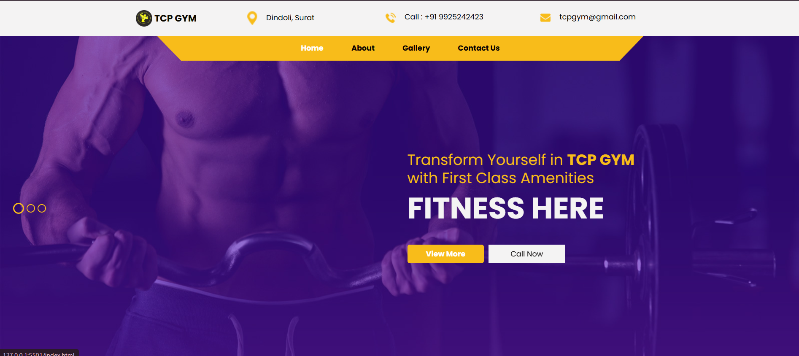
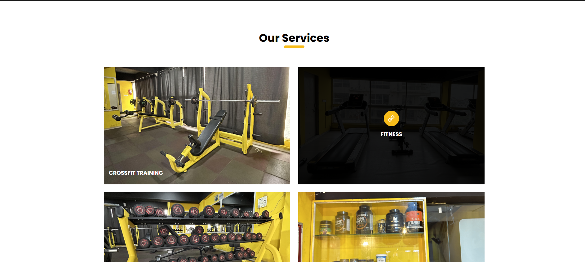
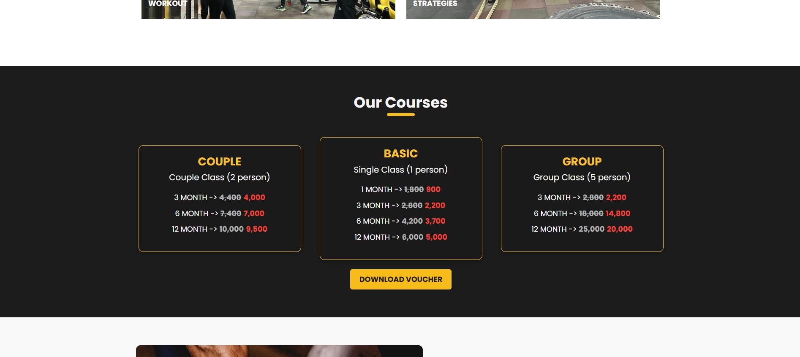
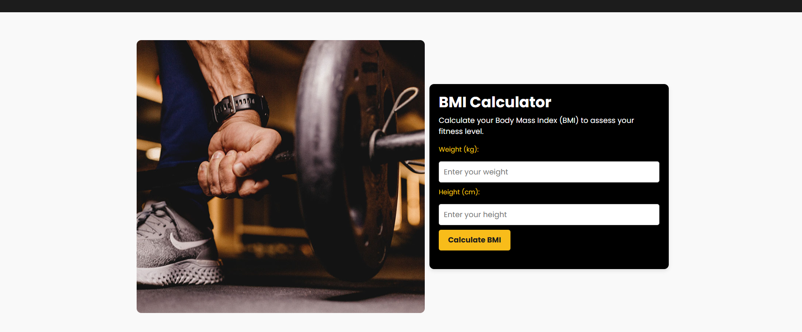
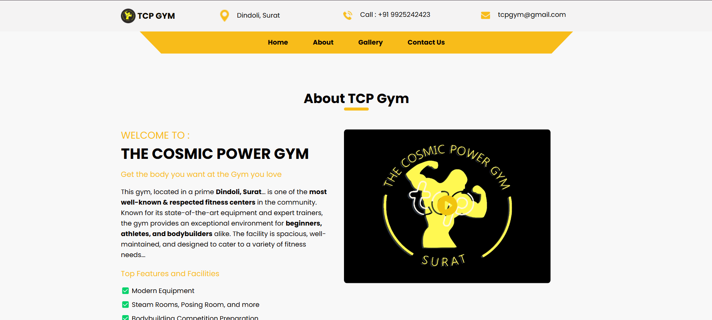
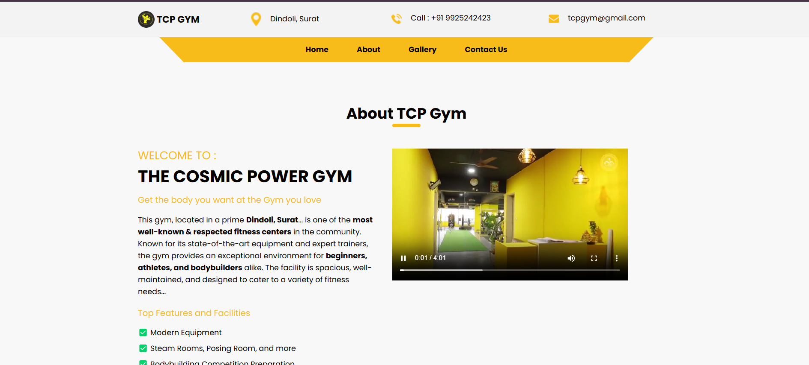
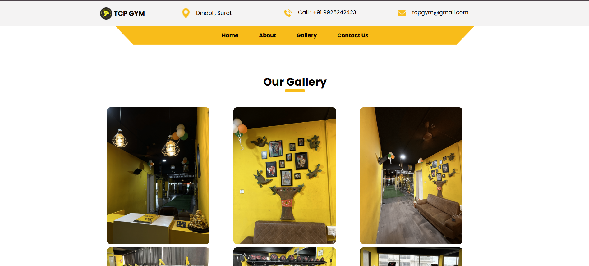
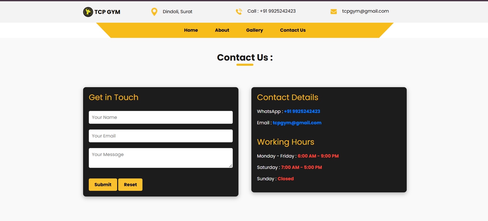

# 🏋️‍♂️ Gym Website

A modern, responsive gym website designed to showcase your fitness center's offerings and help attract new members! Built with **HTML**, **CSS**, and **JavaScript**, this website combines stunning visuals with seamless functionality.

---

**Language :**


---

## 🌟 Features

- **Responsive Design** 📱  
  Works flawlessly on desktops, tablets, and mobile devices.  

- **Gallery Section** 🖼️  
  Show off your gym's equipment, facilities, and success stories with a sleek, responsive gallery.  

- **Dynamic Navigation** 🧭  
  Smooth and intuitive navigation for a great user experience.  

- **Contact Page** 📞  
  Easily get in touch with your gym through an integrated contact form.  

- **Custom Animations** ✨  
  Engaging animations and hover effects to enhance the visual appeal.  

---

## 🚀 How to Use

1. Clone this repository to your local machine:  
   ```bash
   git clone https://github.com/your-username/gym-website.git
   cd gym-website

---

## 📝Note it down

here, I am not uploading all the photos & vedio in the gallery because all my images are in high quality and facing issues on github... so go to the gallery.html page and drag and drop the photos according to the path...!!

## 🖼️ Screenshots

Here are a few images of the gym website:  

**Home Page**  
 
 
 
 

**About Page**  
  
  

**Gallery Page**  
  

**Contact Page**  
  

---

<h2>📬 Contact</h2>

Feel free to reach me through the below handles if you'd like to contact me.

[](https://www.linkedin.com/in/kiran-pokharkar/)
[](https://www.instagram.com/mr.pokharkar/)
