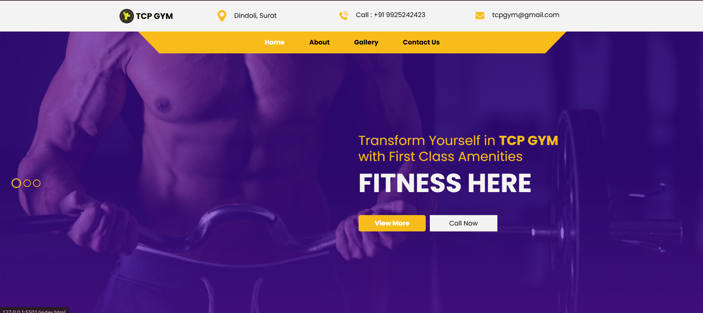
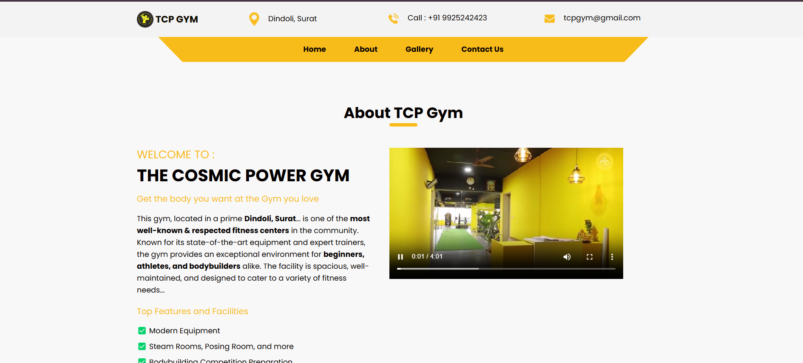
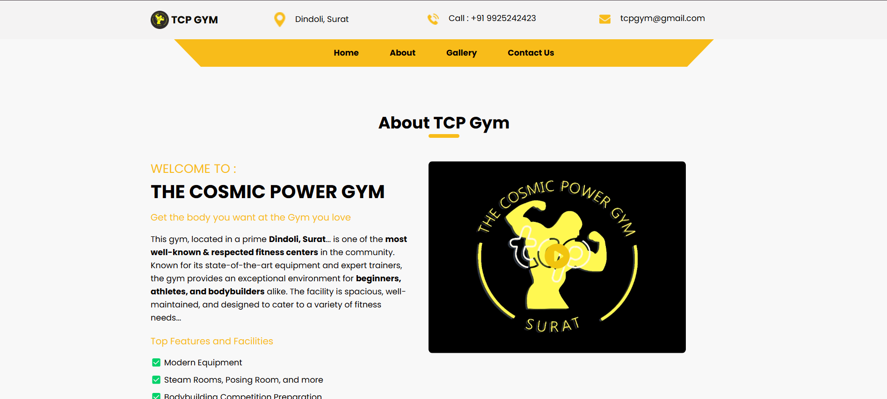
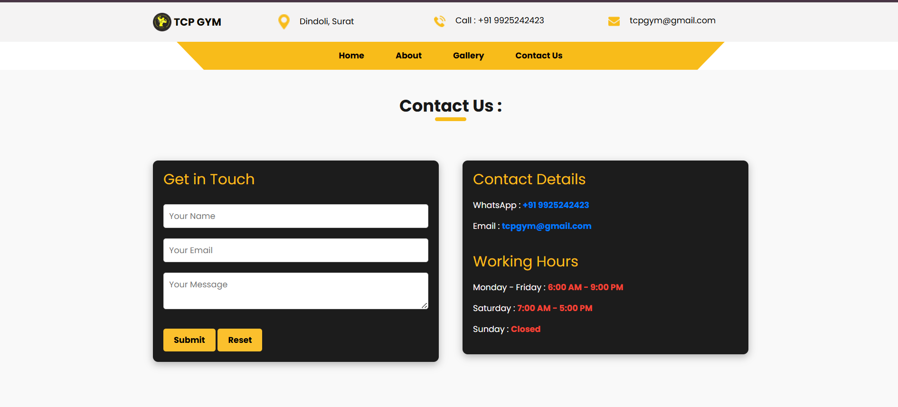

# TCP GYM Website

A modern, responsive gym website built with HTML, CSS, Bootstrap, and JavaScript.

## 🔗 Live Demo
[View Live Website](https://kiranpokharkar2003.github.io/Gym-Website/)

## 📸 Screenshots

### Home Page


### About Page


### Gallery Page


### Contact Page


## 🚀 Features

- Responsive design for all devices
- Modern UI/UX
- Image carousel/slider
- Contact form
- Gallery section
- Location integration with Google Maps

## 🛠️ Technologies Used

- HTML5
- CSS3
- Bootstrap
- JavaScript
- Owl Carousel

## 📦 Installation

1. Clone the repository:
```bash
git clone https://github.com/YOUR_USERNAME/YOUR_REPO_NAME.git
```

2. Open `index.html` in your browser

## 📧 Contact

- Email: tcpgym@gmail.com
- Phone: +91 9925242423
- Location: Dindoli, Surat


<h2>📬 Contact</h2>

Feel free to reach me through the below handles if you'd like to contact me.

[](https://www.linkedin.com/in/kiran-pokharkar/)
[](https://www.instagram.com/mr.pokharkar/)


## 📄 License

This project is open source and available under the MIT License.
